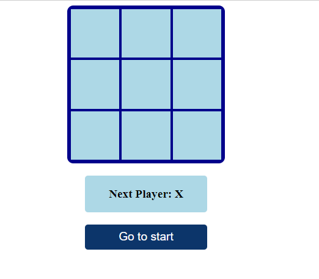
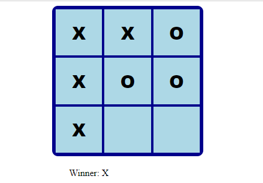
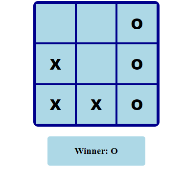

# TIC TAC TOE GAME

https://tic-game-tac.netlify.app/

**First Start**





**First Start**




_Quick start:_

> ```
> $ yarn # pnpm install
> $ yarn build # pnpm run build
> ```

## Development

Run Webpack in watch-mode to continually compile the JavaScript as you work:

```
$ yarn watch # npm run watch # pnpm run watch
```

This template provides a minimal setup to get React working in Vite with HMR and some ESLint rules.

Currently, two official plugins are available:

- [@vitejs/plugin-react](https://github.com/vitejs/vite-plugin-react/blob/main/packages/plugin-react/README.md) uses [Babel](https://babeljs.io/) for Fast Refresh
- [@vitejs/plugin-react-swc](https://github.com/vitejs/vite-plugin-react-swc) uses [SWC](https://swc.rs/) for Fast Refresh

## _App JSX_

```
    import React from "react";
    import Game from "./components/Game";

    const App = () => <Game />;

    export default App;

```

## _helper JSX_

```
    export function calculateWinner(squares) {
    const lines = [
        [0, 1, 2],
        [3, 4, 5],
        [6, 7, 8],
        [0, 3, 6],
        [1, 4, 7],
        [2, 5, 8],
        [0, 4, 8],
        [2, 4, 6]
    ];
    for (let i = 0; i < lines.length; i++) {
        const [a, b, c] = lines[i];
        if (squares[a] && squares[a] === squares[b] && squares[a] === squares[c]) {
        return squares[a];
        }
    }
    return null;
    }

```
