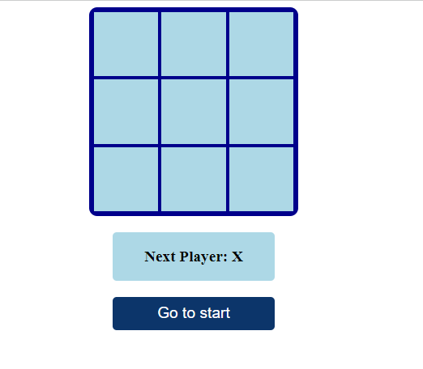
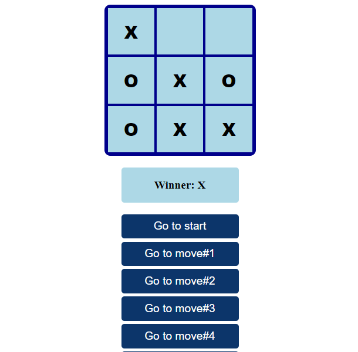
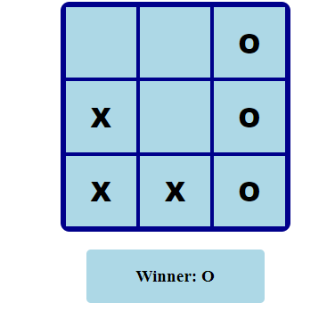

# TIC TAC TOE GAME

A very simple site for playing, tic tac toe game is a populer game in the world. Here, tow players can play, one is ***X*** and other is ***O***. 

https://tic-game-tac.netlify.app/

**First Start**





**First Start**




------

## Before you Begin 🛠 🔨

_Quick start:_

````
$ npm install
$ npm run dev
$ npm start
````

````
$ pnpm install
$ pnpm run dev
$ pnpm start
````

````
$ yarn install
$ yarn run dev
$ yarn start
````


Head over to https://vitejs.dev/ to learn more about using vite

## Cloning the project 🪛🔨

````
# Clone this repository
$ git clone https://github.com/MastooraTurkmen/Tic-Tac-Toe-Game.git

# Go inside the repository
$ cd Tic-Tac-Toe-Game
````


## Languages and Tools are used 🗣️🔧

1. **Languages** 🗣️
    + [HTML](https://github.com/topics/html)
    + [HTML5](https://github.com/topics/html5)
    + [CSS](https://github.com/topics/css)
    + [CSS3](https://github.com/topics/css3)
    + [React](https://github.com/topics/react)
    + [JavaScript](https://github.com/topics/javascript)

2. **Tools** 🔧


## Development

Run Webpack in watch-mode to continually compile the JavaScript as you work:

```
$ yarn watch # npm run watch # pnpm run watch
```

This template provides a minimal setup to get React working in Vite with HMR and some ESLint rules.

Currently, two official plugins are available:

- [@vitejs/plugin-react](https://github.com/vitejs/vite-plugin-react/blob/main/packages/plugin-react/README.md) uses [Babel](https://babeljs.io/) for Fast Refresh
- [@vitejs/plugin-react-swc](https://github.com/vitejs/vite-plugin-react-swc) uses [SWC](https://swc.rs/) for Fast Refresh

## _App JSX_

```
    import React from "react";
    import Game from "./components/Game";

    const App = () => <Game />;

    export default App;

```

## _helper JSX_

```
    export function calculateWinner(squares) {
    const lines = [
        [0, 1, 2],
        [3, 4, 5],
        [6, 7, 8],
        [0, 3, 6],
        [1, 4, 7],
        [2, 5, 8],
        [0, 4, 8],
        [2, 4, 6]
    ];
    for (let i = 0; i < lines.length; i++) {
        const [a, b, c] = lines[i];
        if (squares[a] && squares[a] === squares[b] && squares[a] === squares[c]) {
        return squares[a];
        }
    }
    return null;
    }

```

# _Components_

1. **Board.jsx**
2. **Game.jsx**
3. **Square.jsx**

## _Board JSX_

```
    import React from 'react';
    import Square from './Square';

    const style = {
        border: '4px solid darkblue',
        borderRadius: '10px',
        width: '250px',
        height: '250px',
        margin: '0 auto',
        display: 'grid',
        gridTemplate: 'repeat(3, 1fr) / repeat(3, 1fr)'
    };

    const Board = ({ squares, onClick }) => (
        <div style={style}>
            {squares.map((square, i) => (
                <Square key={i} value={square} onClick={() => onClick(i)} />
            ))}
        </div>
    )

    export default Board;

```

## _Game JSX_

```

    import React, { useState } from "react";
    import { calculateWinner } from "../helpers";
    import Board from "./Board";

    const styles = {
    width: "200px",
    margin: "20px auto",
    };

    const player = {
    padding: "1em",
    background: "lightblue",
    textAlign: "center",
    borderRadius: "5px",
    fontWeight: "bold",
    fontSize: "1.2em",
    };

    const list = {
    textDecoration: "none",
    listStyleType: "none",
    display: "grid",
    };

    const listButton = {
    background: "#0C356A",
    fontSize: "1.2em",
    color: "white",
    padding: ".5em",
    marginBottom: ".3em",
    border: "none",
    borderRadius: "5px",
    cursor: "pointer",
    };

    const Game = () => {
    const [history, setHistory] = useState([Array(9).fill(null)]);
    const [stepNumber, setStepNumber] = useState(0);
    const [xIsNext, setXisNext] = useState(true);
    const winner = calculateWinner(history[stepNumber]);

    const handleClick = (i) => {
        const timeInHistory = history.slice(0, stepNumber + 1);
        const current = timeInHistory[stepNumber];
        const squares = [...current];
        // If user click an occupied square or if game is won, return
        if (winner || squares[i]) return;
        // Put an X or an O in the clicked square
        squares[i] = xIsNext ? "X" : "O";
        setHistory([...timeInHistory, squares]);
        setStepNumber(timeInHistory.length);
        setXisNext(!xIsNext);
    };

    const jumpTo = (step) => {
        setStepNumber(step);
        setXisNext(step % 2 === 0);
    };

    const renderMoves = () =>
        history.map((_step, move) => {
        const destination = move ? `Go to move#${move}` : "Go to start";
        return (
            <li style={list} key={move}>
            <button style={listButton} onClick={() => jumpTo(move)}>
                {destination}
            </button>
            </li>
        );
        });

    return (
        <>
        <Board squares={history[stepNumber]} onClick={handleClick} />
        <div style={styles}>
            <p style={player}>
            {winner
                ? "Winner: " + winner
                : "Next Player: " + (xIsNext ? "X" : "O")}
            </p>
            {renderMoves()}
        </div>
        </>
    );
    };

export default Game;


```

## _Square JSX_

```

    import React from 'react';

    const style = {
        background: 'lightblue',
        border: '2px solid darkblue',
        fontSize: '30px',
        fontWeight: '800',
        cursor: 'pointer',
        outline: 'none'
    };

    const Square = ({ value, onClick }) => (
        <button style={style} onClick={onClick}>
            {value}
        </button>
    );

    export default Square;

```
